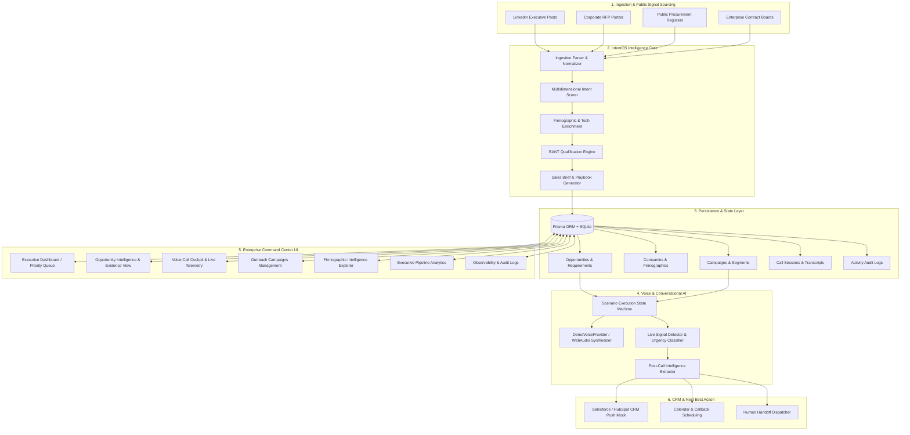
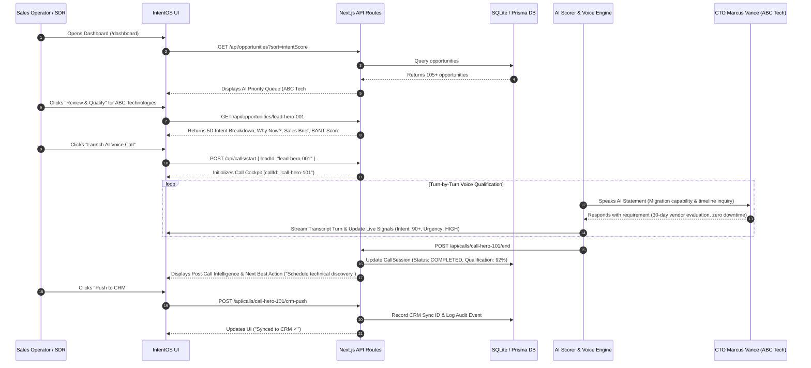

# IntentOS — System Architecture & Data Flow Reference

---

## 1. System Overview

IntentOS is architected as an autonomous enterprise sales intelligence platform combining stream-based public signal ingestion, deterministic intent scoring, automated BANT qualification, bidirectional voice synthesis, and CRM workflow synchronization.

---

## 2. Comprehensive Architectural Diagram

---

## 3. Core Architectural Layers

### 1. Ingestion & Normalization Layer (`src/lib/intelligence/`)
- Ingests raw public requirement text, platform sources, and author titles.
- Normalizes unstructured text into structured requirement models.
- Extracts urgency cues (deadlines, budget allocations, technical specifications).

### 2. Scoring & Heuristic Intelligence Layer (`src/lib/intelligence/intent-scorer.ts`)
- Computes weighted intent score based on 5 dimensions:
  1. Requirement Fit (35%)
  2. Urgency & Timelines (25%)
  3. Decision Maker Authority (15%)
  4. Firmographic ICP Alignment (15%)
  5. Sourcing Channel Reliability (10%)
- Implements deterministic fallback logic guaranteeing 100% test reliability with zero external API calls.

### 3. Voice Qualification & Conversational Layer (`src/lib/voice/`)
- **Scenarios (`src/lib/voice/scenarios.ts`)**: Defines structured multi-turn qualification dialogues across English, Hindi, and Gujarati.
- **Provider (`src/lib/voice/demo-voice-provider.ts`)**: Browser-native WebAudio and SpeechSynthesis engine with zero cloud latency.
- **Live Signal Classifier**: Ingests prospect responses turn-by-turn to extract real-time buying stage, pain points, objections, and decision maker validation.

### 4. Application & API Route Layer (`src/app/api/`)
- `/api/opportunities`: CRUD and multi-facet filtering for sales opportunities.
- `/api/opportunities/[id]`: Opportunity detail, intent breakdown, and pre-call brief generation.
- `/api/calls`: Call session history and active session initiation.
- `/api/calls/start`: Instantiates autonomous voice call session.
- `/api/calls/[id]/end`: Finalizes call session, computes qualification score, and extracts Next Best Action.
- `/api/calls/[id]/crm-push`: Synchronizes contact and opportunity to CRM.
- `/api/calls/[id]/handoff`: Dispatches human handoff request.
- `/api/campaigns`: Outreach campaign CRUD and lead enrollment.
- `/api/intelligence`: Firmographic account catalog and signal telemetry.
- `/api/analytics`: Pipeline conversion metrics and charts data.
- `/api/admin`: Subsystem observability and audit trail logging.
- `/api/demo/reset`: Reseeds database to deterministic benchmark baseline.

### 5. UI Presentation & Component Design System (`src/components/`)
- Built on Next.js 15 App Router with server/client boundaries.
- **Design Tokens**: Standardized CSS variables in `src/app/globals.css`.
- **Layout**: Structured sidebar (`WORKSPACE`, `INTELLIGENCE`, `SYSTEM`), sticky header with global search, notification center, and interactive guided demo trigger.
- **Shared Primitives**: `MetricCard`, `StatusBadge`, `LoadingSkeleton`, `EmptyState`, `ErrorState`, `GuidedDemo`.

---

## 4. End-to-End Data Flow: The Hero Journey

---

## 5. Security, Observability & Data Integrity

- **Audit Logging**: Every sensitive action (`OPPORTUNITY_ANALYZED`, `CALL_COMPLETED`, `CRM_PUSH_COMPLETED`, `HUMAN_HANDOFF_REQUESTED`, `CAMPAIGN_CREATED`) writes an immutable transactional record to `ActivityLog`.
- **Deterministic Reliability**: Zero external API dependencies ensure 100% uptime in local environments and offline hackathon evaluation.
- **Strict Typing**: Full TypeScript coverage across all domain entities (`src/types/`).
