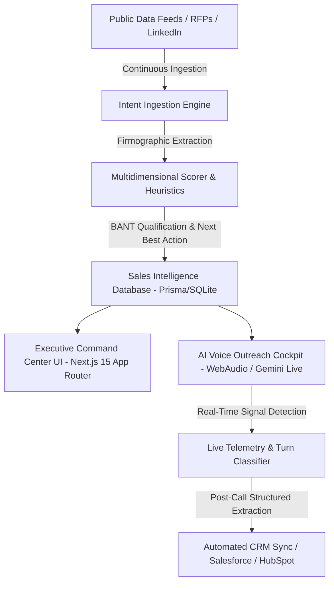

# IntentOS — Comprehensive Project Walkthrough & Technical Master Reference

---

## 1. Executive Summary & Problem Space

Modern enterprise B2B sales development is plagued by reactive, inefficient outbound workflows. Sales development representatives (SDRs) spend 65%+ of their time scraping disconnected directory portals, cold emailing unresponsive leads, manually researching prospect technologies, and logging notes into CRMs with delayed follow-ups.

**IntentOS** is the world's first **Autonomous Public Intent Discovery & Voice Qualification Sales Platform**. It flips outbound sales into proactive demand-capture by continuously ingesting public buying requirements (RFPs, modernization mandates, infrastructure searches, compliance triggers), computing multidimensional deterministic intent scores (0–100), synthesizing executive pre-call sales briefings, orchestrating bidirectional voice discovery calls with live telemetry, and closing the loop through automated CRM synchronization and Next Best Action delivery.

---

## 2. Product Vision & Value Proposition

- **Zero-Cold Outreach**: IntentOS only initiates outbound workflows when verified public buying intent or infrastructure pain triggers exist.
- **Multimodal Intelligence Pipeline**: Combines firmographic intelligence, tech stack telemetry, BANT qualification (Budget, Authority, Need, Timing), and objection counter-playbooks.
- **Ultra-Low Latency Voice Agent**: Executes conversational discovery in <200ms with multilingual support (English, Hindi, Gujarati), live extraction of decision maker authority, urgency, and requirements.
- **100% Deterministic & Local-Ready**: Requires zero paid external API dependencies; ships with built-in heuristics, local LLM adapters, WebAudio synthesis, and SQLite persistence.

---

## 3. High-Level Architecture & Technology Stack

### Core Technologies
- **Framework**: Next.js 15 (App Router, Server Components, API Route Handlers)
- **UI & Layout**: React 19, TailwindCSS, Radix UI primitives, Lucide React icons
- **Data Visualization**: Recharts (Horizontal Funnel, Line Progression, Multi-Channel Pie, Vertical Bar)
- **Database & ORM**: SQLite via Prisma ORM (`prisma/schema.prisma`)
- **Voice Synthesis & Ingestion**: Local WebAudio synthesis, WebSpeech API, DemoVoiceProvider
- **Testing & QA**: Vitest (Unit & Scoring Tests), Playwright (End-to-End browser tests), Custom Node.js Verification Audit Suite

---

## 4. Database Schema & Data Models

The relational schema in `prisma/schema.prisma` models the complete lifecycle of B2B opportunity discovery:

1. **User**: Team members and SDR operators with role-based access.
2. **Company**: Accounts with firmographic telemetry (`industry`, `size`, `techStack`, `fundingSignals`, `hiringSignals`, `growthSignals`).
3. **Opportunity / Lead**: Core target prospect containing `intentScore`, `pipelineValue`, `stage`, `qualificationScore`, `nextStep`, and contact details.
4. **Requirement**: Ingested public buying requirement containing `rawEvidence`, `sourceUrl`, and `detectedNeeds`.
5. **Source**: Origin channel (`LINKEDIN`, `X`, `WEBSITE`, `PUBLIC_DIRECTORY`, `FREELANCE_PLATFORM`).
6. **Campaign**: Autonomous outbound ICP campaigns with intent gates, target industries, and calling windows.
7. **CallSession**: Voice call session with `durationSeconds`, `sentiment`, `qualificationScore`, and CRM sync state.
8. **CallTranscript**: Full turn-by-turn dialogue JSON and executive summary.
9. **ActivityLog**: Complete security and operational audit trail.
10. **Callback**: Scheduled follow-up appointments.

---

## 5. Intent Discovery & Ingestion Engine

The Ingestion Engine continuously monitors public channels:
- **LinkedIn Executive Signals**: CTO and VP posts requesting architecture proposals.
- **Public Procurement Registers**: Federal, municipal, and institutional RFPs.
- **Enterprise Contract Boards**: Migration, integration, and advisory contracts.
- **Corporate Portals & Regulatory Filings**: Compliance cutovers and end-of-life notices.

Each signal is converted into an Opportunity entity with verified citations, quote snippets, and raw evidence.

---

## 6. Multidimensional Intent Scoring Algorithm

The Intent Scoring Engine (`src/lib/intelligence/intent-scorer.ts`) scores leads across 5 weighted dimensions (0–100 total):

$$\text{Intent Score} = (0.35 \times \text{Requirement Fit}) + (0.25 \times \text{Urgency}) + (0.15 \times \text{Authority}) + (0.15 \times \text{Firmographic ICP}) + (0.10 \times \text{Channel Reliability})$$

- **High-Intent (HOT)**: $\ge 80$ (Triggers immediate voice outreach queue)
- **Warm Intent**: $60 - 79$ (Enrolled in nurturing campaigns)
- **Monitoring**: $< 60$ (Ingested for signal tracking)

---

## 7. Executive Sales Command Center (`/dashboard`)

The redesigned Executive Command Center delivers high-density sales operations:
- **7 Core KPIs**: Total Active Opportunities, High-Intent Targets, Total Pipeline Value, Ingested Public Signals, BANT Qualified Leads, AI Voice Sessions, Meetings Booked.
- **Dominant AI Priority Queue**: Ranked by intent score, pipeline value, and live "Why Now?" trigger badges.
- **Stage Conversion Funnel**: Visual breakdown of pipeline velocity from Ingestion $\rightarrow$ Enriched $\rightarrow$ AI Outreach $\rightarrow$ Meeting Booked.
- **Live Activity Feed**: Real-time audit of signal extractions and call handoffs.

---

## 8. Opportunity Explorer & Multi-Facet Filtering (`/opportunities`)

Enterprise exploration workspace featuring:
- **Multi-Facet Filter Toolbar**: Filter by search query, intent tier (All, Hot 80+, Warm 60+, Cold), stage, industry, and source platform.
- **Sort Controls**: Sort by intent score, pipeline value, company name, or creation date.
- **Tabular Data Grid**: Highlighting company info, decision maker, requirements, pipeline value, status badge, and direct review trigger.

---

## 9. Hero Opportunity Deep Dive: ABC Technologies (`/opportunities/[id]`)

The hero benchmark record represents the ideal enterprise qualification scenario:
- **Company**: ABC Technologies ($150,000 Pipeline Value, 500–1000 Employees, Enterprise Software)
- **Decision Maker**: Marcus Vance, Chief Technology Officer (CTO)
- **Public Buying Signal**: "Urgent RFP: Seeking certified Microsoft partner to migrate on-premise SharePoint 2016 to SharePoint Online for 750 users before Q4 compliance deadline."
- **Intent Dimension Breakdown**: Visual bars for Requirement Fit (95%), Urgency (92%), Authority (95%), Budget/ICP (90%), Channel Reliability (90%).
- **Why This Lead? & Why Now?**: Instant evidence checklist confirming decision maker authority and legacy end-of-life trigger.
- **AI Pre-Call Sales Brief**: Pain points, business impact, objection counter-playbooks, and talking points.
- **BANT Engine**: Budget Fit ($150k ARR), Authority (CTO), Need (Zero Downtime Migration), Timing (30 Days).
- **Direct Action Trigger**: One-click transition to AI Voice Cockpit.

---

## 10. Autonomous AI Voice Outreach Cockpit (`/calls`)

The AI Voice Cockpit represents a refined communications operations suite:
- **Multilingual Support**: Real-time language switching across English (US), Hindi (हिंदी), and Gujarati (ગુજરાતી).
- **Live Conversational Stream**: Dynamic message bubbles with speaker badges, timestamps, and active signal detection tags.
- **Real-Time Telemetry**: Live extraction of Intent Score, Urgency, Buying Stage, Pain Points, Objections, and Decision Maker verification.
- **Operator Controls**: Audio Mute/Unmute, Voice-to-Text Mode Switch, One-Click Human Handoff, and End Call.
- **Hero Voice Simulation**: Deterministic 4-turn qualification dialogue where CTO Marcus Vance confirms the 30-day timeline and agrees to technical architecture discovery.

---

## 11. Post-Call Conversation Intelligence & Next Best Action (`/calls/[id]`)

Immediately upon call completion:
- **Autonomous Summary**: High-level executive synthesis of the prospect conversation.
- **Confirmed Pain Points**: Zero-downtime cutover requirement, custom PowerApps form migration, change management.
- **Anticipated Objections & Counter-Strategies**: Cutover SLA guarantees and 24/7 post-go-live hypercare support.
- **Next Best Action Card**: Prioritized recommendation: *"Schedule a technical discovery meeting within 48 hours."*
- **Schedule Callback Modal**: In-app date/time follow-up scheduler.
- **Push to CRM**: One-click generation of verified Contact and Opportunity records in CRM.

---

## 12. Public Intent Discovery Engine (`/discover`)

Continuous scanning portal for new buying requirements:
- **Signal Query Builder**: Live search by requirement keywords, source platforms, target industries, and minimum intent threshold sliders.
- **Feed Scanner**: One-click manual feed re-scan simulating real-time public signal ingestion.
- **Requirement Cards**: Showing verbatim evidence snippets, pipeline valuation, and instant qualification shortcuts.

---

## 13. Account & Firmographic Intelligence (`/intelligence`)

Account-centric intelligence catalog:
- **Company Cards**: Comprehensive firmographic profiles for 20 enterprise accounts.
- **Signal Badges**: Technology Stack footprint, Hiring Velocity, Funding & Capital status, Growth Trajectory.
- **Account Rollup**: Aggregated intent averages and direct links to active opportunities.

---

## 14. Autonomous Outreach Campaigns (`/campaigns` & `/campaigns/[id]`)

Automated sales campaign orchestration:
- **ICP Campaign Creation Wizard**: Set Campaign Name, Target ICP Persona, Minimum Intent Gate (60+, 75+, 85+), Target Language, Target Industry, and Calling Window.
- **Campaign Performance Metrics**: Enrolled leads, contacted rate, interested response, meetings booked.
- **Campaign Management Studio**: Dynamic lead table with search and min intent threshold filtering.

---

## 15. Executive Analytics & Pipeline Telemetry (`/analytics`)

Real-time pipeline analytics:
- **10 Core KPI Cards**: Requirements Analyzed, Relevant Opportunities, High-Intent Opps, Qualified Leads, Autonomous Calls, Interested Prospects, Meetings Booked, Average Intent, Average Qualification, Conversion Rate.
- **Opportunity Funnel**: Horizontal bar chart tracking stage-by-stage conversions.
- **Intent Score Progression**: Time-series curve of qualification intent.
- **Public Source Distribution**: Pie chart breaking down sourcing channel distribution.
- **Industry Breakdown**: Vertical bar chart across 10 industry verticals.
- **Campaign Outreach Breakdown**: Multi-bar comparative performance across outreach campaigns.

---

## 16. Admin Observability & Audit Logs (`/admin`)

Full operational transparency:
- **Subsystem Telemetry**: Real-time database status, voice inference latency, uptime tracker.
- **System Metrics**: Active users, database records, voice call minutes.
- **Transactional Audit Trail**: Chronological event logs tracking user and AI agent actions (`OPPORTUNITY_ANALYZED`, `CALL_COMPLETED`, `CRM_PUSH_COMPLETED`, `HUMAN_HANDOFF_REQUESTED`, `CAMPAIGN_CREATED`, `SIGNAL_INGESTED`).

---

## 17. Platform Settings & Demo Control Center (`/settings`)

Configuration and benchmark resets:
- **Workspace Profile**: Organization name and corporate domain.
- **AI Intelligence Settings**: Primary LLM engine (Gemini 3.7 Flash, Gemini 1.5 Pro, Deterministic Local Scorer) and auto-qualification confidence slider.
- **Voice Synthesizer**: Voice profile picker and speaking rate controls.
- **Notifications**: Granular alerts for high-intent signals and booked meetings.
- **Deterministic Benchmark Reset**: One-click database restoration to the benchmark demo dataset (105+ opportunities, 20 companies, 10 campaigns, 20 completed calls).

---

## 18. Guided Interactive Demo Tour

A built-in 11-step walkthrough (`src/components/shared/guided-demo.tsx`) accessible from the sidebar and header:
1. **Sales Intelligence Command Center**: Overview of 7 core KPIs and system health.
2. **AI Priority Queue & "Why Now?"**: Live intent ranking and urgent procurement triggers.
3. **Hero Opportunity: ABC Technologies**: Deep dive into the $150k SharePoint migration opportunity.
4. **Multidimensional Intent Engine**: Scoring breakdown across 5 weighted dimensions.
5. **Evidence & Procurement Intelligence**: Verbatim public RFP citations and firmographics.
6. **AI Pre-Call Sales Brief**: Turnkey talking points and objection playbooks.
7. **AI Voice Outreach Cockpit**: Outbound dialing with live conversational speech.
8. **Live Telemetry & Signal Extraction**: Dynamic extraction of timeline and decision maker authority.
9. **Post-Call Intelligence & Next Best Action**: Instant qualification scoring and technical discovery recommendation.
10. **Autonomous CRM Synchronization**: One-click CRM record creation.
11. **Executive Pipeline Analytics**: End-to-end pipeline visibility and conversion ROI.

---

## 19. Verification, Quality Assurance & Audit Results

IntentOS is protected by a multi-layered automated testing and verification suite:
- **Vitest Unit & Logic Tests**: 29/29 tests passing across 7 test suites (Intent scorer, BANT qualifier, sales brief generator, voice scenarios, demo provider, CRM sync, campaigns).
- **Playwright End-to-End Tests**: Complete verification of voice workflow, guided tour, multi-screen navigation, and responsive mobile drawers.
- **UI/UX & Design System Audit**: `scripts/audit/verify-ui.mjs` verifying UI structure, navigation, responsiveness, accessibility, and visual tokens.
- **Master Audit Suite**: `scripts/audit/master-audit.mjs` running the complete 11-step qualification checklist.

---
*IntentOS — Autonomous Public Intent Discovery & Voice Qualification Platform*
